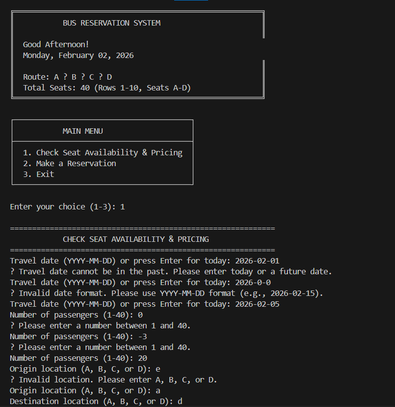
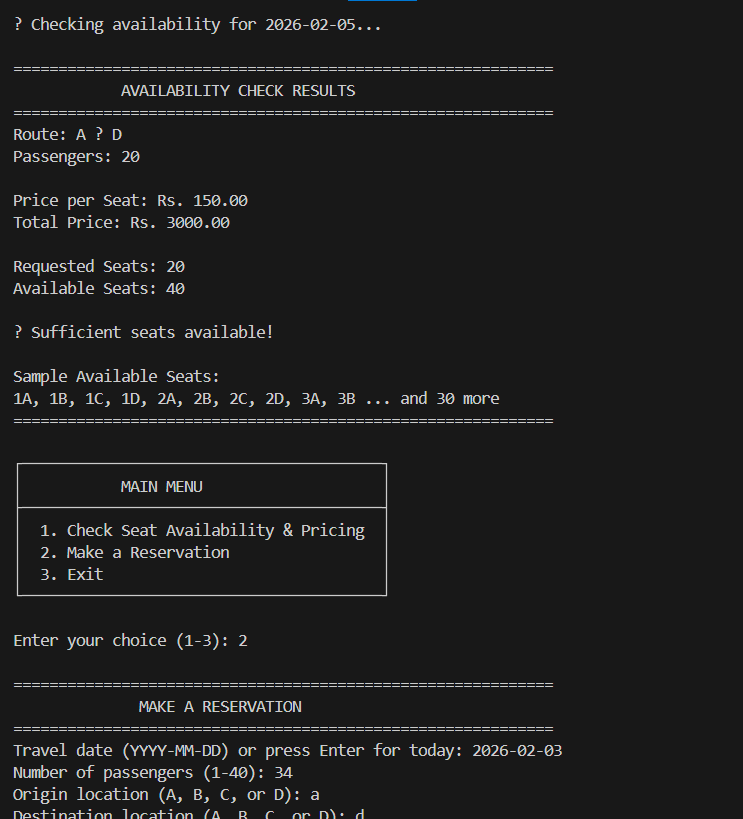
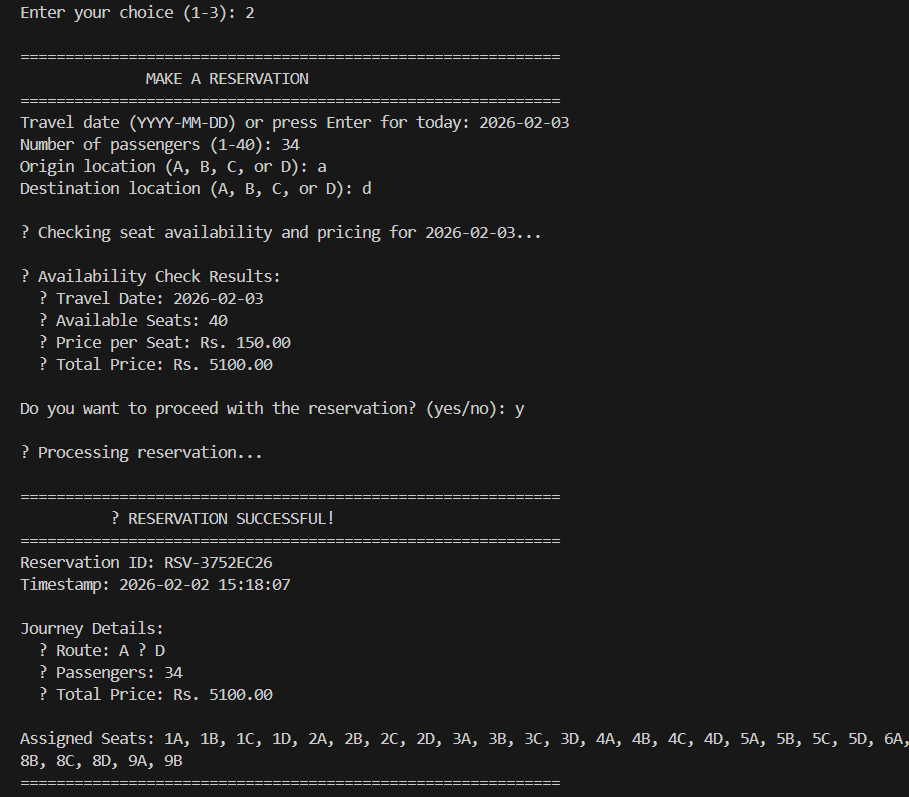
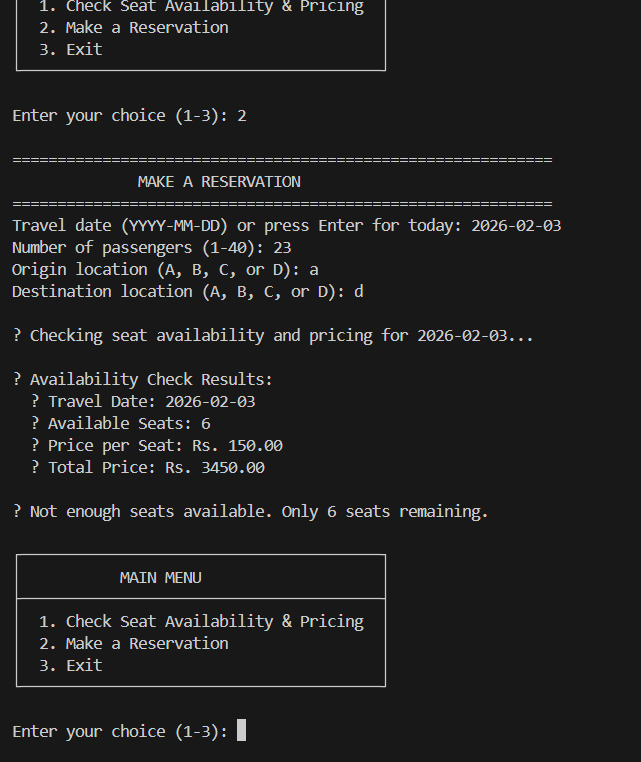

# Bus-Ticket-Reservation-System
Complete bus tickets reservation system: thread-safe REST API backend (Java Servlets, Tomcat) + interactive CLI frontend (Java HttpClient). Implements ReentrantReadWriteLock for race-free booking, clean layered architecture, and RESTful design. No framework dependencies - pure Java mastery.

## 📋 Table of Contents
- [Implemented Features](#implemented-features)
- [System Requirements](#system-requirements)
- [Technology Stack](#technology-stack)
- [Quick Start](#quick-start)
- [System Architecture](#system-architecture)
- [Testing](#testing)

---

## Implemented Features 

| Feature / Requirement | Status | Description |
|----------------------|--------|-------------|
| **4 Location Route System** | ✅  | A → B → C → D linear route with segment-based pricing |
| **40 Seat Management** | ✅  | Seats 1A-10D organized in 10 rows, 4 columns (A, B, C, D) |
| **Availability Check API** | ✅  | `POST /api/availability` - Real-time seat query |
| **Reservation API** | ✅  | `POST /api/reservation` - Instant booking with seat assignment |
| **Thread-safe Operations** | ✅  | `synchronized` methods + `ConcurrentHashMap` |
| **Concurrent Booking Handling** | ✅  | Race condition prevention with ReentrantLock |
| **CLI Client Application** | ✅  | Interactive menu-driven interface |
| **Input Validation** | ✅  | Client-side and server-side validation |
| **Error Handling** | ✅  | Graceful error responses (400, 409, 500) |
| **In-Memory Storage** | ✅  | Fast, no database setup required |
| **Unit & Integration Tests** | ✅  | JUnit 5 + Mockito with high coverage |
| **Concurrent Test Suite** | ✅  | Race condition and overselling prevention tests |
| **Postman Collection** | ✅  | Ready-to-use API test suite |
| **CORS Support** | ✅  | Cross-origin request handling |
| **Debug Mode** | ✅  | Network call logging with `-Ddebug=true` |
| **Timeout Handling** | ✅  | 5-second connection/read timeouts |
| **Docker Support** | ✅  | Containerized deployment with Docker Compose |
| **Trip Date Support** | ✅  | Date-based seat availability tracking |

---

## System Requirements 

### Prerequisites
- **Java**: JDK 17 or higher
- **Maven**: 3.6+ (for building)
- **Apache Tomcat**: 9.0+ (for backend deployment)
- **Operating System**: Windows, Linux, or macOS

### Verify Installation
```bash
# Check Java version
java -version
# Should show: java version "17.x.x" or higher

# Check Maven version
mvn -version
# Should show: Apache Maven 3.6.x or higher
```

---

## Technology Stack

### Backend
| Technology | Version | Purpose |
|-----------|---------|---------|
| **Java** | 17 | Core programming language |
| **Servlet API** | 4.0 | Web framework |
| **Jackson** | 2.16.1 | JSON processing |
| **Maven** | 3.6+ | Build automation |
| **JUnit 5** | 5.9.3 | Testing framework |
| **Mockito** | 5.3.1 | Mocking framework |
| **JaCoCo** | Latest | Code coverage |
| **Apache Tomcat** | 9.0+ | Servlet container |

### Client
| Technology | Version | Purpose |
|-----------|---------|---------|
| **Java** | 17 | Core programming language |
| **HttpURLConnection** | Built-in | HTTP client |
| **Jackson** | 2.16.1 | JSON processing |
| **Maven** | 3.6+ | Build automation |

### Architectural Patterns
- **Layered Architecture** - Separation of concerns (API → Service → Repository)
- **Singleton Pattern** - Services and repositories
- **DTO Pattern** - Data transfer objects
- **Repository Pattern** - Data access abstraction

---

## Quick Start  

### Option 1

### 1. Clone the Repository
```bash
git clone https://github.com/Tharudi-Perera/Bus-Ticket-Reservation-System.git
cd Bus-Ticket-Reservation-System
```

### 2. Build the Backend
```bash
cd backend

# Clean and build
mvn clean package     # Creates: target/bus-reservation.war

# Run tests
mvn test

# Skip tests during build
mvn clean package -DskipTests

```

### 3. Deploy to Tomcat
```bash
# Copy WAR to Tomcat webapps directory
cp target/bus-reservation.war $CATALINA_HOME/webapps/

# Start Tomcat
$CATALINA_HOME/bin/startup.sh      # Linux/Mac
$CATALINA_HOME/bin/startup.bat     # Windows

# Watch deployment logs
tail -f $CATALINA_HOME/logs/catalina.out
# Look for: "Deployment of web application archive ... has finished"
```

### 4. Verify Backend is Running
```bash
# Test health check endpoint
curl http://localhost:8080/bus-reservation/api/test

# Expected response: Message -: "Bus Reservation System API is running"

```

### 5. Build the Client
```bash
cd ../client
mvn clean package
# Creates: target/bus-reservation-client-jar-with-dependencies.jar
```

### 6. Run the Client
```bash
# Default (connects to localhost:8080)
java -jar target/bus-reservation-client-jar-with-dependencies.jar

# Custom backend URL
java -jar target/bus-reservation-client-jar-with-dependencies.jar http://your-server:8080/bus-reservation

# Enable debug mode
java -Ddebug=true -jar target/bus-reservation-client-jar-with-dependencies.jar
```

### Option 2: Docker Deployment

#### Using Docker Compose (Recommended)
```bash
# Build and start all services
docker-compose up --build

# Run in background
docker-compose up -d

# View logs
docker-compose logs -f

# Stop services
docker-compose down
```

#### Manual Docker Commands
```bash
# Build backend image
cd backend
docker build -t bus-reservation-backend .

# Run backend container
docker run -d -p 8080:8080 --name bus-reservation-backend bus-reservation-backend

# Run client (interactive)
cd ../client
docker build -t bus-reservation-client .
docker run -it --network host bus-reservation-client
```

### Welcome Page


### Availability Check


### Make Reservation


### Error Handling


---

## System Architecture   

```
┌────────────────────────────────────────────────────────────┐
│                    CLIENT APPLICATION                      │
│  ┌──────────────┐  ┌──────────────┐  ┌──────────────────┐  │
│  │   CLI Menu   │→ │  HTTP Client │→ │  Request DTOs    │  │
│  │   Interface  │  │   (JSON)     │  │  Response DTOs   │  │
│  └──────────────┘  └──────────────┘  └──────────────────┘  │
└────────────────────────────┬───────────────────────────────┘
                             │ HTTP/JSON over network
                             ▼
┌────────────────────────────────────────────────────────────┐
│                   BACKEND REST API (WAR)                   │
│  ┌──────────────────────────────────────────────────────┐  │
│  │                 API Layer (Servlets)                 │  │
│  │  ┌─────────────┐ ┌──────────────┐ ┌──────────────┐   │  │
│  │  │Availability │ │ Reservation  │ │ Health Check │   │  │
│  │  │  Servlet    │ │   Servlet    │ │   Servlet    │   │  │
│  │  └──────┬──────┘ └──────┬───────┘ └──────┬───────┘   │  │
│  └─────────┼───────────────┼────────────────┼───────────┘  │
│            │               │                │              │
│  ┌─────────┼───────────────┼────────────────┼───────────┐  │
│  │         │        Service Layer           │           │  │
│  │  ┌──────▼──────┐ ┌──────▼───────┐ ┌─────▼──────┐     │  │
│  │  │Availability │ │ Reservation  │ │  Pricing   │     │  │
│  │  │  Service    │ │   Service    │ │  Service   │     │  │
│  │  └──────┬──────┘ └──────┬───────┘ └─────┬──────┘     │  │
│  └─────────┼───────────────┼────────────────┼───────────┘  │
│            │               │                │              │
│  ┌─────────┼───────────────┼────────────────┼───────────┐  │
│  │         │       Repository Layer         │           │  │
│  │  ┌──────▼──────┐       ┌────────▼────────┐           │  │
│  │  │    Bus      │       │   Reservation   │           │  │
│  │  │ Repository  │       │   Repository    │           │  │
│  │  └──────┬──────┘       └────────┬────────┘           │  │
│  └─────────┼───────────────────────┼────────────────────┘  │
│            │                       │                       │
│  ┌─────────┼───────────────────────┼─────────────────────┐ │
│  │         │     Data Storage Layer│                     │ │
│  │  ┌──────▼───────────────────────▼────────┐            │ │
│  │  │     In-Memory Storage                 │            │ │
│  │  │  • ConcurrentHashMap (Seats)          │            │ │
│  │  │  • CopyOnWriteArrayList (Reservations)│            │ │
│  │  │  • Thread-safe Collections            │            │ │
│  │  └───────────────────────────────────────┘            │ │
│  └───────────────────────────────────────────────────────┘ │
└────────────────────────────────────────────────────────────┘

┌─────────────────────────────────────────────────────────────┐
│                 Cross-Cutting Concerns                      │
│  • JSON Serialization (Jackson)                             │
│  • Validation (Server-side)                                 │
│  • Exception Handling                                       │
│  • Thread Safety (Synchronized + Locks)                     │
└─────────────────────────────────────────────────────────────┘
```

---

## Testing  

### Run All Tests
```bash
cd backend
mvn test
```

### Run Specific Test Class
```bash
mvn test -Dtest=BusReservationSystemTest
mvn test -Dtest=ConcurrentReservationTest
```

### Test Categories

#### Unit Tests
- Service layer business logic
- Pricing calculations (all route combinations)
- Validation rules
- Singleton pattern verification
- Repository operations

#### Integration Tests
- End-to-end reservation flows
- API endpoint testing
- Error handling scenarios
- All location combinations

#### Concurrent Tests
- Race condition prevention
- Thread safety verification
- No overselling validation
- Multiple simultaneous bookings
- Last seat scenarios

### Postman Testing

#### Import Collection
1. Open Postman
2. Click **Import** → **Upload Files**
3. Select `Bus_Reservation_System_collection.json`
4. Run test requests

#### Available Tests
- ✅ Health check endpoint
- ✅ Availability checks (all routes)
- ✅ Successful reservations
- ✅ Error scenarios (400, 409)
- ✅ Edge cases (40 passengers, last seats)

